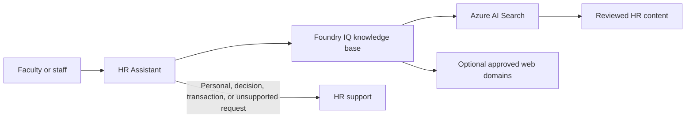

# HR Assistant

A customer-followable guide and sample content pack for building a standalone, grounded
**HR Assistant** with **Microsoft Foundry**, **Foundry IQ**, and **Azure AI Search**.

The assistant provides Tier-1 guidance for HR policies, benefits, leave, payroll, and open
enrollment. It cites approved sources and directs personal, transactional, decision-related, or
unsupported requests to HR. It does not connect to the Student Services Assistant.

> [!IMPORTANT]
> This baseline does not access employee records, make employment decisions, check case status,
> or submit benefit elections. It is not a system of record or legal advice. Organizations remain
> responsible for privacy, security, accessibility, legal, labor, benefits, and policy review.

## Start Here

Follow the **[HR Assistant build guide](hr-assistant-build-guide.md)**. It uses the same customer
journey as the Student Services workshop:

1. Understand the solution components and safety boundary.
2. Prepare the Foundry project and model deployments.
3. Build through the Foundry portal, or follow the equivalent Python path.
4. Connect approved documents through Azure AI Search and optional allow-listed web grounding.
5. Apply Microsoft Entra role-based access.
6. Test citations, refusal, escalation, and no-answer behavior.
7. Troubleshoot identity and retrieval issues.
8. Complete production-readiness follow-up.

## What Is Included

| Path | Purpose |
| --- | --- |
| `hr-assistant-build-guide.md` | Portal and Python build instructions, RBAC, tests, and troubleshooting. |
| `architecture-design.md` | Standalone architecture, trust boundaries, and future HRIS gate. |
| `data/` | Fictional sample HR documents that must be replaced and approved before production. |
| `python-scripts/ingest_search.py` | Keyless ingestion into an Azure AI Search vector/semantic index. |
| `.env.example` | Public-safe configuration template containing placeholders only. |
| `index.html` | GitHub Pages renderer for the build guide. |
| `requirements.txt` | Python dependencies for document ingestion. |

## Architecture



This is one HR agent, not a multi-agent system. The knowledge base contains only approved general
reference material. Employee records remain in the HR system and outside model grounding,
conversation memory, evaluation prompts, and logs.

## Quick Start

1. Review and replace every sample file in `data/`.
2. Create the Foundry project, chat model, embedding model, and Search service described in the guide.
3. Install the ingestion dependencies:

   ```powershell
   python -m venv .venv
   .\.venv\Scripts\Activate.ps1
   python -m pip install -r requirements.txt
   ```

4. Set `AZURE_SEARCH_ENDPOINT` and `AZURE_OPENAI_ENDPOINT`, then run:

   ```powershell
   python python-scripts\ingest_search.py
   ```

5. Create `hr-assistant-kb`, attach the Search index and any approved web source, and create the agent.
6. Apply the RBAC and release tests in the build guide before publishing.

## GitHub Pages

The root `index.html` renders `hr-assistant-build-guide.md` as a navigable training site.
In repository **Settings > Pages**, choose **Deploy from a branch**, select `main`, and use
`/ (root)`.

## Public Repository Safety

This repository intentionally contains no deployed resource IDs, tenant or subscription IDs,
credentials, API keys, tokens, connection strings, employee records, or local Azure/Foundry state.
Use the commented placeholders in `.env.example` and the build guide to document required values,
then supply real values through local environment variables, managed identity, or an approved
secret store. Run a secret scan before changing the repository visibility to public.

## Production Boundary

A future read-only case-status capability must be a separately approved HRIS adapter using
Microsoft Entra delegated authorization, source-system enforcement, minimum fields, and synthetic
data during development. Benefit writes require an additional approval gate, explicit user
confirmation, idempotency, validation, audit, and revocation design. Neither capability is enabled
in this repository.

## License

MIT
