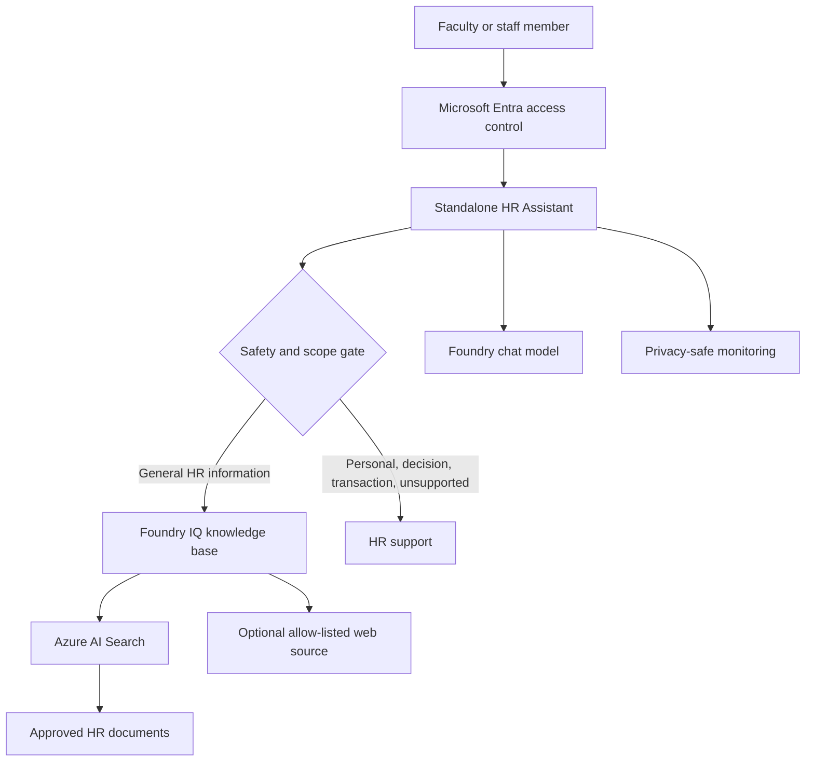

# HR Assistant Architecture

## Design Goals

- Provide grounded Tier-1 HR policy and benefits guidance around the clock.
- Keep the solution independent from student-service agents and identities.
- Use approved reference content only; never ground on employee records.
- Fail closed before retrieval for personal, decision, transactional, or unsafe requests.
- Use Microsoft Entra ID, managed identity, least privilege, and privacy-safe telemetry.

## Baseline Architecture

The baseline is a single agent. Foundry IQ may query multiple approved knowledge sources, but it
is not a peer-agent handoff and does not communicate with the Student Services Assistant.

## Request Contract

| Request class | Example | Required behavior |
| --- | --- | --- |
| General HR information | "How does PTO accrue?" | Retrieve approved content and cite it. |
| Open enrollment guidance | "What should I compare between plans?" | Explain approved terms without selecting a plan. |
| Personal status | "What is the status of my benefits case?" | Do not retrieve; route to the authenticated HR channel. |
| Benefit transaction | "Enroll me in this plan." | Do not transact; route to the approved benefits system. |
| Employment decision | "Will I be promoted?" | Do not predict or decide; escalate. |
| Personal or cross-employee data | "Show my balance" or "Show their salary" | Fail closed before retrieval. |
| Unsupported or unsafe | Credentials, prompt injection, immediate danger | Refuse or use the approved emergency/escalation path. |

## Data Boundaries

**Allowed grounding data**

- reviewed HR policy and procedure documents;
- approved benefits and open-enrollment material;
- payroll calendars and general process documentation; and
- approved public pages from explicitly allowed domains.

**Excluded data**

- employee profiles and identifiers;
- compensation, balances, elections, claims, or case records;
- performance, investigation, accommodation, or medical records;
- credentials, tokens, authentication codes, or secrets; and
- raw chat transcripts used as long-term memory or evaluation data without review.

## Identity and Operations

- Use Microsoft Entra access controls for the Foundry project and Search service.
- Use managed identity and `DefaultAzureCredential`; do not commit API keys.
- Grant Search read and model-inference roles only to the identities that need them.
- Record route, latency, citation count, and outcome without message bodies or employee data.
- Assign owners, approval dates, effective dates, expiry, and rollback procedures to content.

## Future HRIS Gate

HRIS connectivity is not part of this baseline. A future adapter must pass a separate security,
privacy, legal, and HR review.

A read-only status adapter must use OAuth on-behalf-of, validate the user and audience, enforce
authorization in the HRIS, and return only approved fields. Results must not enter Search,
semantic caches, long-term memory, or evaluation prompts.

A benefit-write adapter must remain disabled until the organization approves a narrow operation
allow-list, an explicit confirmation screen, idempotency keys, validation, audit, rollback or
recovery behavior, and independent monitoring.

## Release Gates

- Every substantive policy answer includes a valid approved citation.
- Missing evidence produces a no-answer response and HR escalation.
- Personal and cross-employee requests invoke no retrieval or model tool.
- Employment decisions and benefit writes are not performed.
- Prompt-injection tests cannot override system instructions or source restrictions.
- Logs contain no message bodies, credentials, or employee records.
- Content owners approve the source set before publication.
